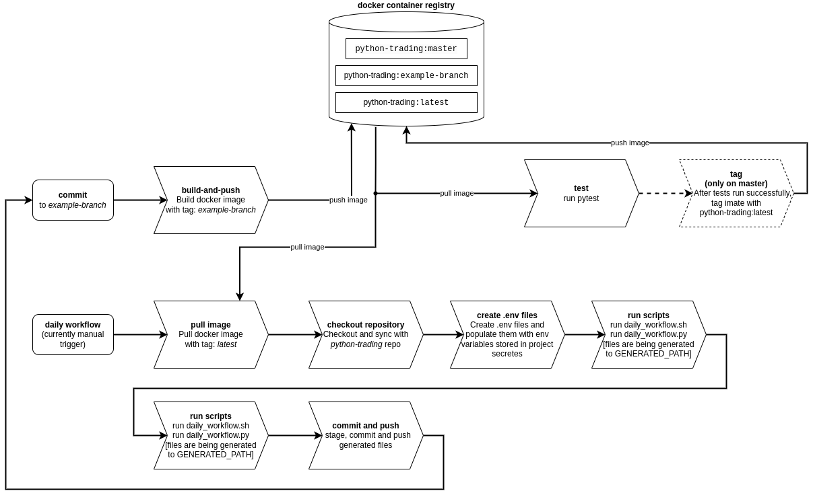

# Python Financial Framework
 

### A multi-tool trading, investing, and asset management platform
- Trading instruments (seamlessly connecting with XTB brokers)
- Stock monitoring and analysis (fusing data from different vendors, such as XTB, yahoo finance, alphaspread)
- Loan monitoring and analysis, for keeping track of your loans, as well as informed decision making between a loan an an investment
- Investment monitoring and analysis, for keeping track of your investments and other assets (precious metals)
- Symbols and constants management (investing.com, alphaspread, XTB). yfinance coming soon

This framework is made to work with an [XTB client](https://github.com/doruirimescu/XTBApi). However, you can implement your own platform's client and use it with [my wrapper](https://github.com/doruirimescu/python-trading/tree/master/Trading/live/client)

First step after cloning: `./install_requirements.sh`

Second step: read [this](https://github.com/doruirimescu/python-trading/tree/master/Trading/live/scripts#readme)

### Navigation
This repo is HUGE, and you will probably not need 90% of the things in here.

* Loan management [here](https://github.com/doruirimescu/python-trading/blob/master/Trading/loan/README.md)
* Investment and precious metal model [here](https://github.com/doruirimescu/python-trading/blob/master/Trading/model/investment.py)
* Precious metal investment tracking [here](https://github.com/doruirimescu/python-trading/tree/master/Trading/investment)
* Alerts [here](https://github.com/doruirimescu/python-trading/tree/master/Trading/live/alert)
* Alphaspread cli for stock analysis [here](https://github.com/doruirimescu/python-trading/tree/master/Trading/stock/alphaspread)
* Rest api [here](https://github.com/doruirimescu/python-trading/tree/master/Trading/api)
* Daily nasdaq 100 analysis with alphaspread [here](https://github.com/doruirimescu/python-trading/tree/master/Trading/generated)
* Dividend growth analysis [here](https://github.com/doruirimescu/python-trading/blob/master/Trading/stock/yfinance/dividend_sustainability.py)

# Pipeline structure

The main pipeline consists of two parts: main and other workflows.

# Snapshots

